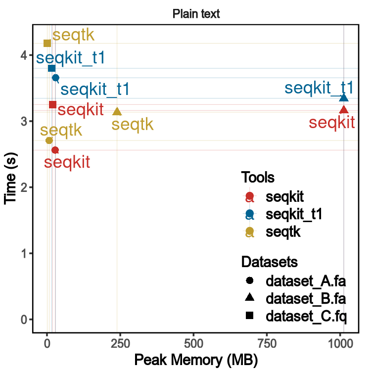

bio
===

A lightweight and high-performance
(see [seqkit](https://github.com/shenwei356/seqkit#benchmark) benchmark)
bioinformatics package.

FASTA/Q parsing
-----------------------

***This package has high performance close to the famous C lib
[`kseq.h`](https://github.com/attractivechaos/klib/blob/master/kseq.h).***

To test the performance, three datasets are used:

- dataset_A, bacteria genomes, 2.7G
- dataset_B, human genome,     2.9G
- dataset_C, Illumina reads,   2.2G

Summary by [`seqkit`](https://github.com/shenwei356/seqkit):

    file           seq_format   seq_type   num_seqs   min_len        avg_len       max_len
    dataset_A.fa   FASTA        DNA          67,748        56       41,442.5     5,976,145
    dataset_B.fa   FASTA        DNA             194       970   15,978,096.5   248,956,422
    dataset_C.fq   FASTQ        DNA       9,186,045       100            100           100

[`seqtk`](https://github.com/lh3/seqtk/)
(Version [1.1-r92-dirty](https://github.com/lh3/seqtk/tree/fb85aad4ce1fc7b3d4543623418a1ae88fe1cea6),
using `kseq.h`)
and [`seqkit`](https://github.com/shenwei356/seqkit)
(Version [v0.3.1.1](https://github.com/shenwei356/seqkit/releases/tag/v0.3.1.1),
using this package) were used to test.
**Note** that `seqtk` does not support wrapped (fixed line width) ouputing, so `seqkit` uses
`-w 0` to disable outputing wrapping.
Script [`memusg`](https://github.com/shenwei356/memusg) is used to assess running time
and peak memory usage.

[Commands](https://github.com/shenwei356/bio/blob/master/benchmark/run_benchmark_01_parse.sh)

Tests were repeated 5 times and average time and memory usage were computed.

Results:

Install
-------
This package is "go-gettable", just:

    go get -u github.com/shenwei356/bio

More
----
See the README of sub package.

Documentation
-------------
[See documentation on godoc for more detail](https://godoc.org/github.com/shenwei356/bio/).

Copyright (c) 2013-2016, Wei Shen (shenwei356@gmail.com)

[MIT License](https://github.com/shenwei356/bio/blob/master/LICENSE)
